# Redes Neurais Convolucionais (CNNs)

## O que são Redes Neurais Convolucionais?

Redes Neurais Convolucionais (CNNs, do inglês *Convolutional Neural Networks*) são um tipo de arquitetura de rede neural profunda projetada especificamente para processar dados com estrutura espacial, como imagens, vídeos e sinais multidimensionais. Elas são amplamente utilizadas em tarefas de visão computacional, reconhecimento de padrões e classificação de imagens.

### Características Principais:

1. **Convolutions (Convoluções)**
A operação de convolução é a espinha dorsal das CNNs. Consiste em deslizar um kernel (filtro) sobre a entrada para produzir um feature map.

    - Matematicamente: A equação para calcular o valor de um pixel no feature map de saída é:

    
    
    O termo I (Input Image/Image de Entrada):
    - O que é: Representa a imagem de entrada, geralmente uma matriz 2D (grayscale) ou 3D (colorida, com canais RGB).

    -   Formato: 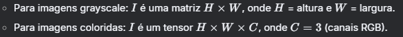

    O termo K (Kernel/Filtro): 
    - O que é: Uma matriz pequena (ex: 3×3) de pesos aprendidos durante o treinamento. 
    - Formato: K é uma matrix F X F, F é o tamanho do kernel
    - 

    O termo i,j (Coordenadas no Feature Map de Saída):
    - O que são: Índices que indicam a posição do pixel no feature map resultante.
    - 

    O termo m,n (Índices do Kernel):
    - O que são: Índices que percorrem as linhas (m) e colunas (n) do kernel.
    - 

    O termo I(i+m,j+n) (Região da Imagem Sob o Kernel):
    - O que é: A submatriz da imagem I coberta pelo kernel na posição atual.
    - Fornece os pixels que interagem com o kernel para gerar o valor de saída.

    O termo ⋅ (Multiplicação Elemento a Elemento)
    - O que é: Operação de multiplicação entre cada pixel da região da imagem (I(i+m,j+n)) e o peso correspondente do kernel (K(m,n)).

    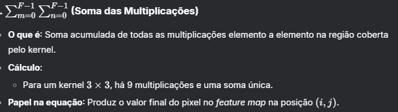

    - Nota: Canais de Cor (RGB): Em imagens coloridas, a equação inclui uma soma adicional sobre os canais

    

2. **Kernel Size and Depth (Tamanho e Profundidade do Kernel)**

- Os kernels podem ter varios de tamanhos.
- Geralmente de tamanho impar, pois possuem mais simetria entre pontos centrais da janela. 
- Tamanho do mapa de características resultante : Tamanho da entrada - Tamanho do Kernel + 1

- Kernels menores:

    - Capturam detalhes locais.

    - Reduzem parâmetros (eficientes computacionalmente).

- Kernels maiores:

    - Capturam contexto global.

    - Úteis em camadas iniciais para downsampling.

- Profundidade (D):

    - Número de kernels em uma camada.

    - Define quantos tipos de features são extraídos.

    Exemplo: 64 kernels → 64 feature maps distintos.

3. **Padding**

- Adição de zeros ou valores ao redor da entrada para controlar o tamanho da saída. 
- O objetivo do padding é manter o tamanho da saída do feature map igual ao da imagem de entrada. Para isso, a adição de zeros envolta da entrada é necessária. 

- Para redes muito profundas, não queremos continuar reduzindo o tamanho

- Os pixels nas bordas contribuem menos para os mapas de características de saída, portanto, estamos descartando informações deles.

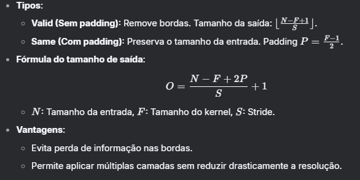

Nota: A fórmula é aplicada para cada dimensão do mapa final.

4. **Stride**

- Define quantos pixels o kernel se move a cada passo.
- basicamente, o tamanho do passo define o tamanho da saída. Com stride 1, não há redução de tamanho, porém um stride 2 (cada passo pular 2 linhas e 2 colunas na matrix) reduz pela metade o tamanho.

- Efeitos:
    - Stride S = 1: Sobreposição máxima (maior precisão).
    - Stride S = 2: Reduz a resolução pela metade (downsampling).

- Exemplo:

    - Entrada 5×5, kernel 3×3, stride 2:
    - Saída 2×2 (sem padding).

- Aplicação:
    - Substitui camadas de pooling em algumas arquiteturas (ex: Conv com stride 2).

5. **Função de ativação ReLU**

Vamos explorar a função de ativação ReLU (Rectified Linear Unit) em profundidade, incluindo sua definição matemática, propriedades, vantagens, limitações e variações. Esta é uma das funções de ativação mais utilizadas em redes neurais profundas, especialmente em CNNs.
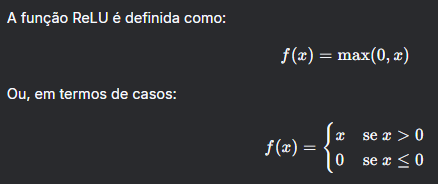

- Por que ReLU é Usada?
    - ReLU introduz não-linearidade na rede neural, permitindo que o modelo aprenda relações complexas nos dados. Comparada a funções como sigmoid ou tanh, ela resolve dois problemas críticos:

    - Vanishing Gradient: Derivadas próximas de zero em saturação (comum em sigmoid e tanh para valores extremos).

    - Eficiência Computacional: Cálculos simples (apenas comparações e multiplicações).

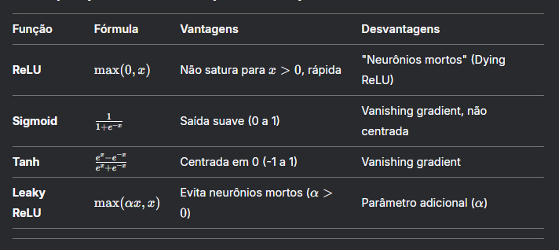

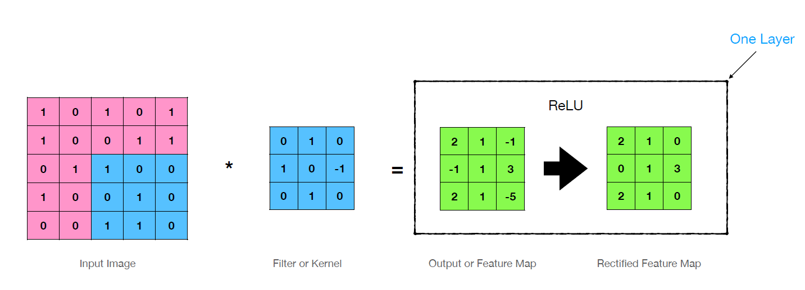

6. **Pooling**

- O Pooling é uma operação de redução dimensional aplicada a feature maps (mapas de características) para:

    - Reduzir a complexidade computacional: Diminui o tamanho espacial das matrizes.

    - Controlar overfitting: Reduz o número de parâmetros.

    - Garantir invariância a pequenas transformações: Como translações, rotações ou mudanças de escala.

    - Preservar características dominantes: Destaca padrões mais relevantes.

    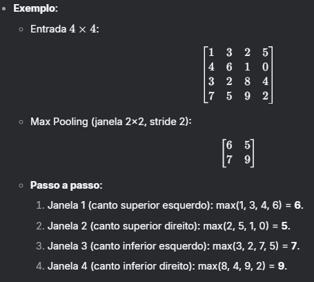
    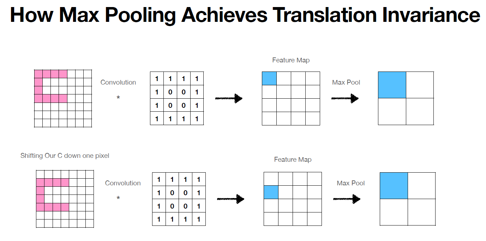

    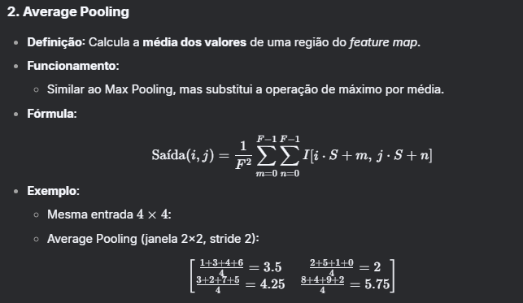

    Outros Tipos de Pooling
    - Min Pooling: Seleciona o menor valor da região (pouco utilizado).

    - Global Pooling: 
        - Global Average Pooling: Calcula a média de todo o feature map (usado em redes como GoogLeNet para substituir camadas densas).

        - Global Max Pooling: Seleciona o valor máximo de todo o feature map.

    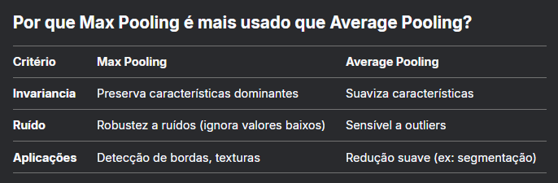

7. **Camada totalmente conectada**

Conecta todos os neurônios da camada anterior à atual, geralmente usada no final para classificação.
Os mapas de características são transformados em um vetor unidimensional (Flatten (ou em português, achatamento)), de modo a servir de entrada para a rede.
A rede totalmente conectada normalmente pode ser qualquer rede neural para classicação/regressão.
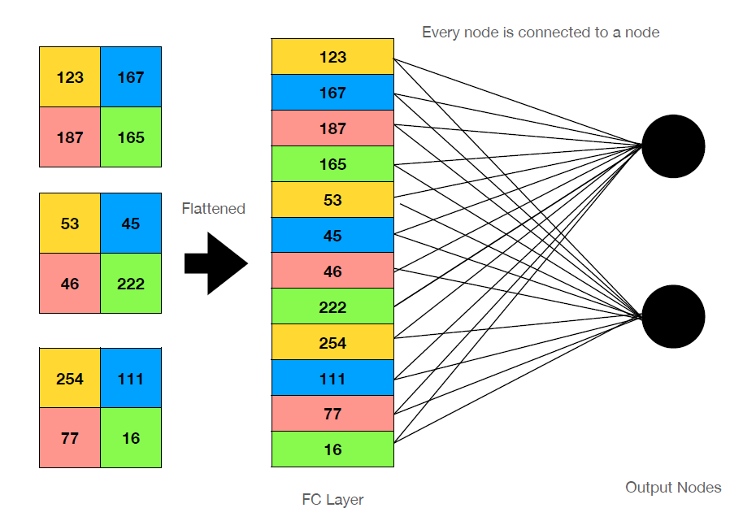

8. **Função de ativação Softmax**

Função de ativação para problemas de classificação multi-classe.

A função Softmax converte um vetor de valores reais em uma distribuição de probabilidade.

- Propriedades Fundamentais
    - A soma das probabilidades de saída é sempre 1 Isso permite interpretar as saídas como probabilidades de pertencer a cada classe.
    - Amplificação de Diferenças, fazendo a exponenciação da saída, enfatizando a maior Diferença.

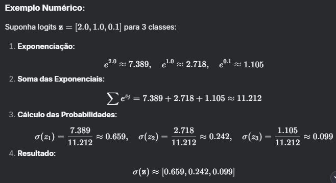

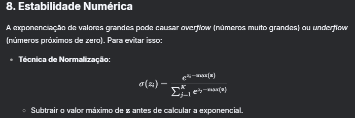

Em redes neurais, Softmax é combinada com a Cross-Entropy Loss para treinamento:
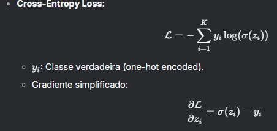
