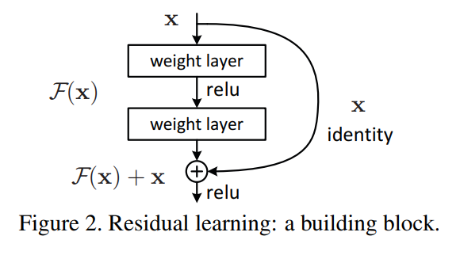

# Arquitetura ResNet (Residual Networks)

## 1. Introdução

ResNet (Residual Network) (https://arxiv.org/abs/1512.03385), proposta por Kaiming He et al. em 2015, revolucionou o treinamento de redes profundas ao introduzir conexões “skip” (atalhos) que aliviam o problema de **degradação** e **gradientes desaparecidos** em redes muito profundas. Modelos baseados em ResNet venceram o ImageNet 2015 e permitiram treinar redes com centenas de camadas com desempenho superior.

---

## 2. Motivação

1. **Gradientes Desaparecidos/Explodindo**  
   À medida que as redes crescem em profundidade, o gradiente que flui de volta pela cadeia de derivadas tende a se tornar muito pequeno ou muito grande, dificultando o aprendizado de camadas iniciais.

2. **Degradação do Desempenho**  
   Surpreendentemente, simplesmente empilhar mais camadas sem mudanças leva a piora na acurácia de treino e validação — mesmo quando não há overfitting. Isso indica que camadas adicionais não aprendem transformações úteis.

ResNet aborda esses pontos permitindo que o bloco aprenda **resíduos** em vez de mapeamentos diretos.

---

## 3. Bloco Residual

### 3.1. Formulação

Em vez de aprender \( \mathcal{H}(x) \) diretamente, o bloco residual aprende  
\[
\mathcal{F}(x) := \mathcal{H}(x) - x
\]  
de forma que a saída final seja  
\[
y = \mathcal{F}(x) + x.
\]  

- **\(x\)**: entrada do bloco  
- **\(\mathcal{F}(x)\)**: “função residual” aprendida (tipicamente duas ou três camadas convolucionais + normalização + ReLU)  
- **Skip Connection**: soma elemento a elemento de \(x\) com \(\mathcal{F}(x)\)



### 3.2.  Bottleneck Block em ResNet

O **bottleneck block** é a variante de bloco residual usada em redes ResNet mais profundas (ResNet-50, -101, -152 e superiores). Seu objetivo principal é **reduzir o custo computacional** e o número de parâmetros enquanto mantém (ou expande) a profundidade da rede.

---

#### 1. Estrutura Geral

Um bottleneck block é composto por **três** camadas convolucionais em vez de duas:

1. **Conv 1×1 (Redução de Canais)**  
   - Reduz a dimensionalidade dos mapas de característica de \(C_{\text{in}}\) canais para \(C_{\text{mid}}\) canais (tipicamente \(C_{\text{mid}} = C_{\text{in}}/4\)).  
   - Objetivo: diminuir o número de canais antes da convolução 3×3, economizando operações.

2. **Conv 3×3**  
   - Opera sobre \(C_{\text{mid}}\) canais; mantém o “tamanho espacial” (padding=1, stride=1 ou 2).  
   - Essa camada faz o processamento espacial pesado, mas em menos canais.

3. **Conv 1×1 (Expansão de Canais)**  
   - Reexpande de \(C_{\text{mid}}\) para \(C_{\text{out}}\) canais (normalmente igual a \(C_{\text{in}}\) ou múltiplo de 4).  
   - Restaura (ou aumenta) a profundidade do mapa de características para manter compatibilidade com o atalho.

Em seguida, faz-se a **soma elemento a elemento** (skip connection) entre a saída dessas três convoluções e a entrada original (talvez passando por um “downsample” quando dimensões mudam), sofrendo um `ReLU` final:

```text
Input x (C_in canais)
   │
   ├──► [Conv 1×1 (C_in → C_mid) → BN → ReLU
         Conv 3×3 (C_mid → C_mid) → BN → ReLU
         Conv 1×1 (C_mid → C_out) → BN] ──► (+) ──► ReLU ──► Output y
   │                                   ↑
   └───────────────────────────────────┘  (atalho / skip connection)
   
```


## 4. Construção de Redes ResNet

| Variante  | Blocos Básicos | Bottlenecks | Profundidade Total |
|:---------:|:--------------:|:-----------:|:------------------:|
| ResNet-18 | 4×(2 convs)    | —           | 18 camadas        |
| ResNet-34 | 6×(2 convs)    | —           | 34 camadas        |
| ResNet-50 | —              | 3×(3 convs) | 50 camadas        |
| ResNet-101| —              | 3×(3 convs) | 101 camadas       |
| ResNet-152| —              | 3×(3 convs) | 152 camadas       |

> Cada “bloco” acima refere-se a um *stage* com tamanho de feature map constante; entre stages, aplica-se convolução 1×1 com stride=2 (ou max-pool) no atalho para reduzir dimensões.

---